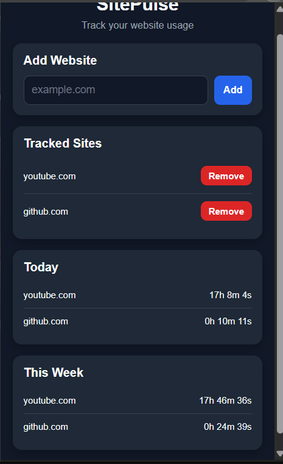

# SitePulse Chrome Extension

Track how much time you spend on specific websites with real-time updates and daily logging.

---

## 🚀 Features
- Track time spent on selected websites
- Real-time tracking updates
- Daily usage logging
- Add/remove tracked domains
- Simple popup dashboard

---

## 🛠️ Tech Stack
- JavaScript
- Chrome Extension API (Manifest V3)
- chrome.storage API

---

## 📦 Installation

1. Download or clone this repository
2. Open Chrome and go to:
   chrome://extensions
3. Enable Developer Mode
4. Click Load unpacked
5. Select the project folder

---

## 📸 Preview

---

## 🔮 Future Improvements
- Weekly usage charts - DONE(3/18/2026)
- Notifications for time limits
- CSV export
- Productivity analytics dashboard

---

## 👨‍💻 Author
Daonte Dallas
